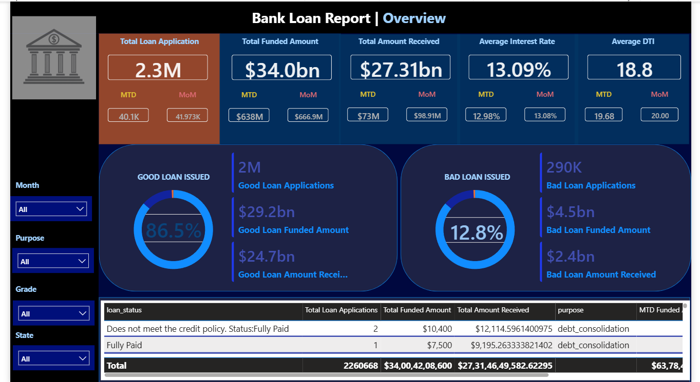
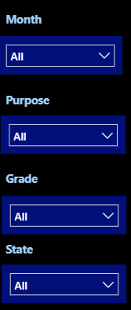

# 📊 Dashboard & Analysis Preview

## 🏦 Power BI Dashboard

The interactive Power BI dashboard provides a comprehensive overview of the bank loan portfolio, including key performance indicators, loan quality, funding, repayment, and filtering options.

  

---

## 📌 Key Performance Indicators (KPIs)

The dashboard includes important KPIs to monitor loan application, funding, and repayment performance.

  

---

## 🟢 Good Loan Analysis

The Good Loan analysis provides insights into the percentage and performance of loans classified as good loans.

  

---

## 🔴 Bad Loan Analysis

The Bad Loan analysis helps identify the proportion and performance of loans associated with higher repayment risk.

  

---

## 🔎 Interactive Filters

The dashboard includes interactive filters that allow users to explore loan data based on different dimensions such as:

- Month
- Purpose
- Grade
- State
- Year

  

---

## 🏦 Bank Logo

  

